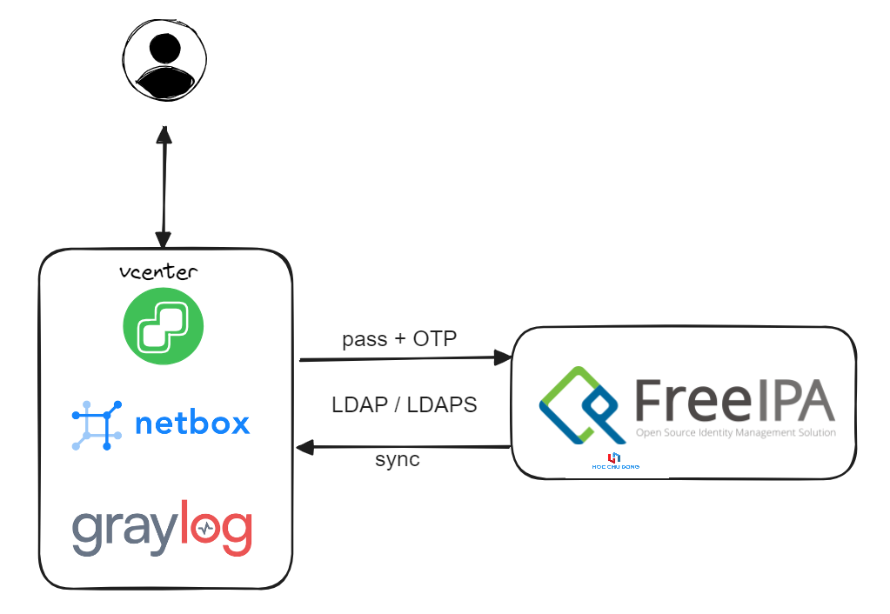
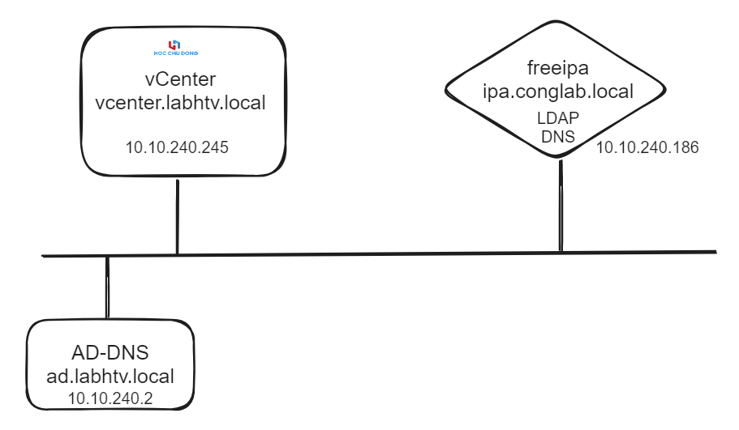
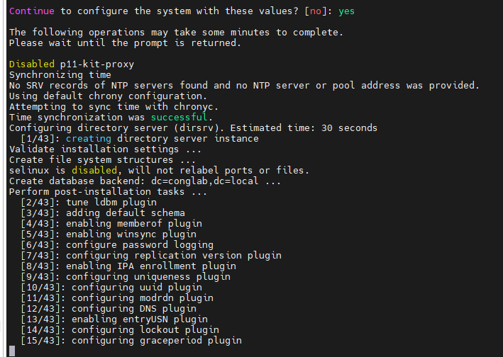

# Tích hợp Freeipa, vCenter (netbox, graylog, checkmk .....) và kích hoạt xác thực có OPT (2FA)

# MỤC LỤC
- [Tích hợp Freeipa, vCenter (netbox, graylog, checkmk .....) và kích hoạt xác thực có OPT (2FA)](#t-ch-h-p-freeipa--vcenter--netbox--graylog--checkmk---v--k-ch-ho-t-x-c-th-c-c--opt--2fa-)
  * [Giới thiệu](#gi-i-thi-u)
    + [Ưu điểm](#-u--i-m)
    + [Nhược điểm](#nh--c--i-m)
  * [Môi trường](#m-i-tr--ng)
    + [Mô hình](#m--h-nh)
  * [Cài đặt FreeIPA](#c-i---t-freeipa)
  * [Tích hợp freeipa với vcenter và kích hoạt OTP](#t-ch-h-p-freeipa-v-i-vcenter-v--k-ch-ho-t-otp)
    + [Tạo user cho freeipa](#t-o-user-cho-freeipa)
    + [Thực hiện tích hợp freeipa và khai báo trên vcenter](#th-c-hi-n-t-ch-h-p-freeipa-v--khai-b-o-tr-n-vcenter)
    + [Kích hoạt tính năng OPT cho user của freeipa để sử dụng khi đăng nhập](#k-ch-ho-t-t-nh-n-ng-opt-cho-user-c-a-freeipa----s--d-ng-khi---ng-nh-p)

<small><i><a href='http://ecotrust-canada.github.io/markdown-toc/'>Table of contents generated with markdown-toc</a></i></small>


## Giới thiệu
Với tình hình các rủi ro an ninh hiện nay và các khuyến cáo từ háng, các team security là bật được xác thực gì bật hết, càng nhiều lớp càng tốt. 

Do vậy nhu cầu OTP cho các ứng dụng đang rất cần thiết, một số ứng dụng thì có sẵn tính năng OTP, một số thì chưa có, một số thì lại cần đầu tư hoặc bản free thì hạn chế user, cần kết nối internet. 

Trong bài viết này HCD team giới thiệu phương án sử dụng FreeIPA để cung cấp cơ chế LDAP/LDAPS cho việc xác thực với các ứng dụng hỗ trợ tích hợp LDAP với các ứng dụng cho phép. Ngoài ra, trên freeipa có cơ chế cung cấp OTP cho user được tạo bởi nó nên giải pháp này khả quan để ae sử dụng cho nhu cầu xác thực cần OTP. 



### Ưu điểm

- Chỉ cần một máy linux cấu hình vừa phải, 4CPU, 8GB RAM, 100GB disk.
- Không cần kết nối ra Internet để nhận OPT.
- Không bị limit user sử dụng khi tích hợp
- Free
- Có thể tích hợp với các sản phẩm hỗ trợ LDAP/LDAPS (vcenter, netbox, graylog, checkmk ....)

### Nhược điểm

- Phương án không thấy vlware công bố hỗ trợ nên phải tự vọc, tự xử lý.

## Môi trường

Centos 8, RHEL8, Centos 9 hoặc RHEL 9

Lab này sử dụng RHEL8

Lưu ý trong lab này dùng freeipa làm dns cho domain hcdlab.local luôn mặc dù trước đó với vcenter đã có dns server khác.

Vcenter 7.0.3, domain vcenter.labhtv.local (10.10.240.245)

Freeipa 4.9.11, domain ipa.congtolab.local (10.10.240.186)

### Mô hình 



## Cài đặt FreeIPA

Setup ip tĩnh nếu cần, giả sử ip là 10.10.240.186 

Cấu hình hostname

```
hostnamectl set-hostname ipa.conglab.local

echo "10.10.240.186  ipa.conglab.local ipa" >> /etc/hosts
```

Cấu hình timezone

Cấu hình firewalld, selinux với centos, rhel

Cài đặt module hỗ trợ bổ sung gói freeipa

```
dnf module enable idm:DL1
```

Cài đặt gói freeipa 

```
dnf install ipa-server ipa-server-dns -y
```

Cấu hình freeipa có tích hợp DNS (DNS server là máy cài freeipa luôn)

```
ipa-server-install --setup-dns
```

Trong các màn hình khai báo, nhập các tham số cần thiết.

```
Server host name [ipa.conglab.local]: ipa.conglab.local

Please confirm the domain name [conglab.local]: conglab.local

Please provide a realm name [CONGLAB.LOCAL]: CONGLAB.LOCAL

Directory Manager password:
Password (confirm):

IPA admin password:
Password (confirm):

Do you want to configure DNS forwarders? [yes]: yes

Do you want to configure these servers as DNS forwarders? [yes]:yes

Enter an IP address for a DNS forwarder, or press Enter to skip:

Do you want to search for missing reverse zones? [yes]: no

NetBIOS domain name [CONGLAB]: CONGLAB

Do you want to configure chrony with NTP server or pool address? [no]: yes
Enter NTP source server addresses separated by comma, or press Enter to skip:

Enter a NTP source pool address, or press Enter to skip:

Continue to configure the system with these values? [no]: yes
```

Chờ màn hình cài đặt thực hiện các bước 



Sau khi cài xong sẽ có màn hình sau


Trường hợp có dùng firewalld thì cần allow các port ở trên

```
firewall-cmd --permanent --add-service=ntp
firewall-cmd --permanent --add-service=http
firewall-cmd --permanent --add-service=https
firewall-cmd --permanent --add-service=ldap
firewall-cmd --permanent --add-service=ldaps
firewall-cmd --permanent --add-service=kerberos
firewall-cmd --permanent --add-service=kpasswd
firewall-cmd --reload
```

Kiểm tra xem freeipa hoạt động chưa bằng lệnh `ipactl status` kết quả như sau là ok

```
[root@ipa ~]# ipactl status
Directory Service: RUNNING
krb5kdc Service: RUNNING
kadmin Service: RUNNING
named Service: RUNNING
httpd Service: RUNNING
ipa-custodia Service: RUNNING
pki-tomcatd Service: RUNNING
ipa-otpd Service: RUNNING
ipa-dnskeysyncd Service: RUNNING
ipa: INFO: The ipactl command was successful

```

Cần thiết khởi động lại máy sau khi cài và kiểm tra status lại cho chắc.

Xác nhận lại token admin bằng lệnh `kinit admin` và `klist` , nếu đăng nhập thành công và in ra kết quả token thì freeipa đã hoạt động.

```
[root@ipa ~]# kinit admin
Password for admin@CONGLAB.LOCAL:
[root@ipa ~]# klist
Ticket cache: KCM:0
Default principal: admin@CONGLAB.LOCAL

Valid starting       Expires              Service principal
06/07/2024 14:06:30  06/08/2024 13:57:22  krbtgt/CONGLAB.LOCAL@CONGLAB.LOCAL

```

Truy cập vào web bằng URL [`https://ipa.conglab.local/ipa/ui/`](https://ipa.conglab.local/ipa/ui/) 

Nhập tài khoản admin và mật khẩu ở bước cài đặt trước đó.


Đăng nhập


Tới bước này đã hoàn thành việc cài đặt freeipa, chuyển sang các bước tích hợp với các nền tảng như vcenter, netbox và kích hoạt OTP

## Tích hợp freeipa với vcenter và kích hoạt OTP

Mặc định và háng vlware không tuyên bố hỗ trợ freeipa nên trước khi tích hợp freeipa với vcenter và sử dụng được OPT thì cần điều chỉnh lại schema cho freeipa tương thích với openldap (cái mà vlware hỗ trợ).

Cấu hình điều chỉnh schemal của freeipa để tương thích với vcenter.

Tạo file `vsphere_usermod.ldif` trên máy chủ freeipa

```
dn: cn=users,cn=Schema Compatibility,cn=plugins,cn=config
changetype: modify
add: schema-compat-entry-attribute
schema-compat-entry-attribute: objectclass=inetOrgPerson
-
add: schema-compat-entry-attribute
schema-compat-entry-attribute: sn=%{sn}
-
```

Tạo file `vsphere_groupmod.ldif` trên máy chủ freeipa 

```
dn: cn=groups,cn=Schema Compatibility,cn=plugins,cn=config
changetype: modify
add: schema-compat-entry-attribute
schema-compat-entry-attribute: objectclass=groupOfUniqueNames
-
add: schema-compat-entry-attribute
schema-compat-entry-attribute: uniqueMember=%mregsub("%{member}","^(.*)accounts(.*)","%1compat%2")
-
```

Thực hiện lệnh sau để apply thay đổi các điều chỉnh trên

```
ldapmodify -x -D "cn=Directory Manager" -f vsphere_groupmod.ldif -W -v
ldapmodify -x -D "cn=Directory Manager" -f vsphere_usermod.ldif -W -v
```

Sau khi cấu hình xong, truy cập vào giao diện freeipa khai báo thêm các user để sử dụng đăng nhập vào vcenter sau này.


### Tạo user cho freeipa

Tạo một vài user để kiểm tra


Ta có 2 user 


Mở các phiên đăng nhập khác để login vào các user vừa tạo để đổi mật khẩu lần đầu và xác nhận việc truy cập thành công.


Tới bước này ta đã có user trên freeipa để sử dụng 

### Thực hiện tích hợp freeipa và khai báo trên vcenter

Trước khi vào vcenter, ssh vào máy freeipa hoặc dùng winscp down file CA của freeipa về để dùng cho bước sau.

Tải file `/etc/ipa/ca.crt` về máy tính 


Khai báo file host trong vcenter để trỏ được dns của máy freeipa vì trong lab này sử dụng 2 domain khác nhau.

```
root@vcenter [ ~ ]# cat /etc/hosts
# Begin /etc/hosts (network card version)

# VAMI_EDIT_BEGIN
# Generated by Studio VAMI service. Do not modify manually.
127.0.0.1  vcenter.labhtv.local vcenter localhost
::1  vcenter.labhtv.local vcenter localhost ipv6-localhost ipv6-loopback
# VAMI_EDIT_END

10.10.240.186 ipa.conglab.local

```

Đăng nhập vào web vcenter và chọn theo hương dẫn

Chọn tab administrator ⇒ Single Sign On ⇒ Configuration ⇒ Add


Ở cửa sổ khai báo ADD, chọn Identity Source Type là “Open LDAP” 


Và khai báo các tham số nhử bên dưới, lưu ý bước chọn Certificate ta brower tới file ca.crt đã tải về trước đó.


Sau khi add thành công, ta thiết lập mặc định cơ chế đăng nhập cho domain trên freeipa. 


Chuyển sang tab User and Group để kiểm tra xem user đã đồng bộ sang hay chưa.


Tới đây đã đồng bộ user từ freeipa sang nhưng chưa được phân quyền. Tiếp tục bước phân quyền trên vcenter để có thể sử dụng user của freeipa để đăng nhập vào vcenter.

Chọn cluster trên vcenter, sau đó vào tab permision 


Chọn add thêm usre với domain của freeipa


Sau đó mở một trình duyệt khác để đăng nhập thử.


Ta sẽ thấy màn hình đăng nhập của user hcd1@conglab.local. Tới bước này tôi chưa kích hoạt OTP để kiểm tra việc tích hợp trước.


### Kích hoạt tính năng OPT cho user của freeipa để sử dụng khi đăng nhập

Đăng nhập vào user admin của freeipa để kích hoạt OTP đối với các user cần thiết, tại đây ta chọn chế độ đăng nhập sử dụng bằng cách xác thực nào cho user


Sau đó save lại


Tiếp tục chọn tab Action để tạo QR code cho user hcd1 


Ở màn hình khai báo dưới, có thể nhập thêm tham số, nếu không cần thì chọn ADD


Sau khi add sẽ có QR code để gửi cho user và user cần dùng các tool quản lý QR code như google authen để quét và dùng sau này.


Lúc này user hcd1 đã có qr code và nhận được các chuỗi số random. 


User hcd1 bắt đầu mở trình duyệt đăng nhập của freeipa hoặc vcenter để nhập mật khẩu + chuối số trên công cụ quản lý code ở điện thoại theo dạng `Mật khẩu và nối tiếp chuỗi OPT sinh ra ở ứng dụng điện thoại"

Giả sử mật khẩu là “Hocchud0ng” và OPT là 231234 thì nhập vào khung mật khẩu là `Hocchud0ng231234` 


Tới đây đã hoàn thành bước cấu hình.